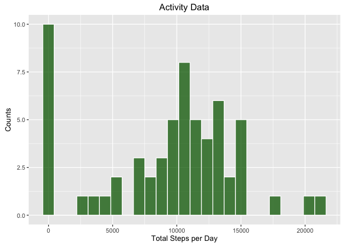
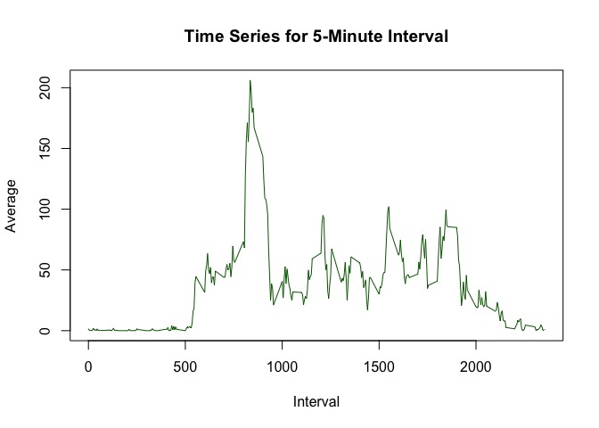
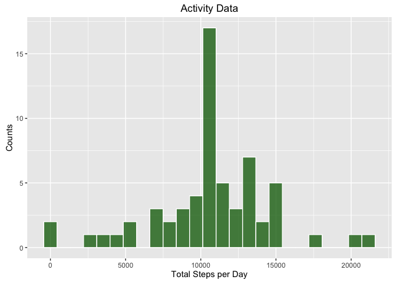
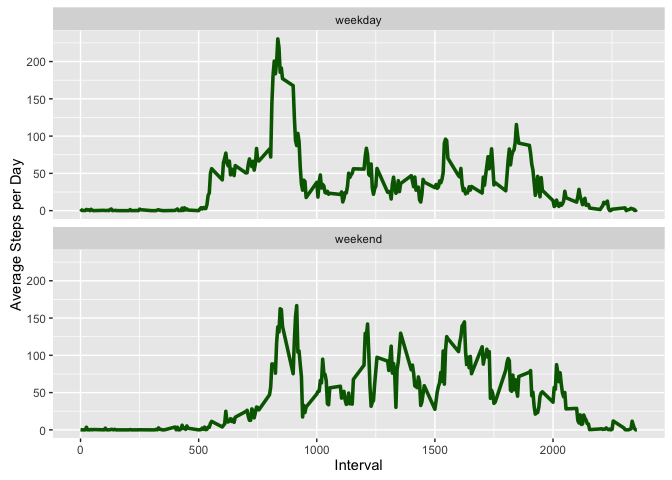

# Reproducible Research: Peer Assessment 1


## Loading and preprocessing the data

Loading the required packages.


```r
library(dplyr)
```

```
## 
## Attaching package: 'dplyr'
```

```
## The following objects are masked from 'package:stats':
## 
##     filter, lag
```

```
## The following objects are masked from 'package:base':
## 
##     intersect, setdiff, setequal, union
```

```r
library(ggplot2)
```

Loading the Activity Monitor Dataset:


```r
unzip("activity.zip")
d <- read.csv("activity.csv")
```

## What is mean total number of steps taken per day?

Group the data by date and calculate the total number of steps.


```r
q1 <- d %>% group_by(date) %>% summarise(total_per_day = sum(steps, na.rm = TRUE))
```

Plot histogram of total steps per day:


```r
p1 <- p1 <- ggplot(q1, aes(x=total_per_day))
p1 + geom_histogram(bins = 25, color = "white", fill = "darkgreen", alpha = 0.75) + labs(x = "Total Steps per Day", y = "Counts", title = "Activity Data")
```

<!-- -->

Mean of the total number of steps taken per day is:

```r
meantsp <- mean(q1$total_per_day)
print(meantsp)
```

```
## [1] 9354.23
```

Median of the total number of steps taken per day is:

```r
mediantsp <- median(q1$total_per_day)
print(mediantsp)
```

```
## [1] 10395
```

## What is the average daily activity pattern?

Getting the average across all days per 5-minute interval


```r
q2 <- d %>% group_by(interval) %>% summarise(average_per_day = mean(steps, na.rm = TRUE))
```

Time series plot:


```r
plot(q2$interval, q2$average_per_day, col="darkgreen", type = "l", 
     xlab = "Interval", ylab="Average", main  = "Time Series for 5-Minute Interval")
```

<!-- -->

Interval with Maximum average:


```r
maxInterval <- q2[q2$average_per_day ==  max(q2$average_per_day),]
print(maxInterval$interval)
```

```
## [1] 835
```

## Imputing missing values

Calculating the number of rows with missing values:


```r
n_missing <- sum(is.na(d$steps))
print(n_missing)
```

```
## [1] 2304
```

Imputing the missing values with the mean of the interval:

```r
q3 <- d %>% group_by(interval) %>% summarise(mean = mean(steps, na.rm = TRUE))
new_d <- d

for (i in 1:length(new_d[,1])) {
    if (is.na(new_d$steps[i])) {
        c_interval <- new_d$interval[i]
        new_d$steps[i] <- q3$mean[q3$interval == c_interval]
    }
}
```

Summarize the data after imputation to compare with previous results:


```r
q3_2 <- new_d %>% group_by(date) %>% summarise(total_per_day = sum(steps))
```

Plot histogram of total steps per day:


```r
p3 <- p3 <- ggplot(q3_2, aes(x=total_per_day))
p3 + geom_histogram(bins = 25, color = "white", fill = "darkgreen", alpha = 0.75) + labs(x = "Total Steps per Day", y = "Counts", title = "Activity Data")
```

<!-- -->

New Mean of the total number of steps taken per day is:


```r
meantsp_new <- mean(q3_2$total_per_day)
print(meantsp_new)
```

```
## [1] 10766.19
```

New Median of the total number of steps taken per day is:


```r
mediantsp_new <- median(q3_2$total_per_day)
print(mediantsp_new)
```

```
## [1] 10766.19
```

## Are there differences in activity patterns between weekdays and weekends?

A function to return true or false whether a given day is a weekday or on a weekend:


```r
isWeekday <- function(x) {
    xs <- weekdays(as.Date(x))
    loglist = vector()
    
    for (s in xs) {
        if (grepl(s, "Sunday") | grepl(s, "Saturday")) {
            loglist <- append(loglist, FALSE)
        }
        else {
            loglist <- append(loglist, TRUE)
        }    
    }
    loglist
}
```

Add a new column with the variable day_type to indicate whether the day is a weekday or on a weekend:


```r
l <- isWeekday(new_d$date)
new_d <- new_d %>% mutate(day_type = ifelse(l, "weekday", "weekend"))
```

Summarize the imputed data by interval and day type:


```r
q5 <- new_d %>% group_by(interval, day_type) %>% summarise(average_per_day = mean(steps, na.rm = TRUE))
```

Plot the time series according to the new day_type variable:


```r
ggplot(q5,
       aes(x=interval, y=average_per_day)) + 
        geom_line(color = "darkgreen", lwd=1.25) + 
            facet_wrap(~day_type, 2,1) + 
            labs(x = "Interval", y="Average Steps per Day")
```

<!-- -->


